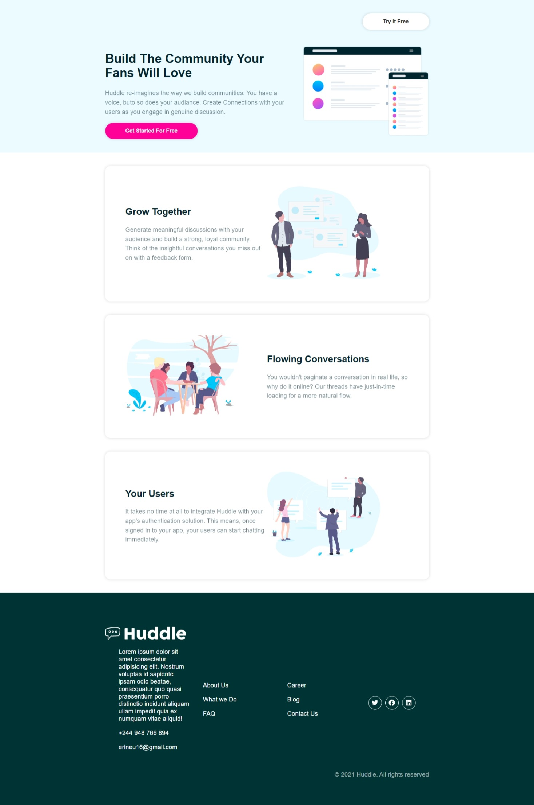
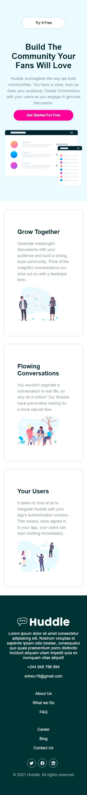

# Huddle Landing Page

Huddle landing page is a project created with React starring React Styled Components. It is a part of a challenge provided by Frontend Mentor (Huddle landing page with alternating feature blocks).

## What to Expect

The Corresponding Project Screens (both Web and Mobile) are as shown below.

### Web Layout

;

### Mobile Layout

;

## Running The Project

To start using the project Fork it or Download to you machine and In the project directory, run:

### `npm install`

To install all project dependencies and after that

### `npm start`

To run the app in the development mode.\
Open [http://localhost:3000](http://localhost:3000) to view it in your browser.

The page will reload when you make changes.\
You may also see any lint errors in the console.

If needed you may run

### `npm run build`

To Build the app for production to the `build` folder.\
It correctly bundles React in production mode and optimizes the build for the best performance.

The build is minified and the filenames include the hashes.\
Your app is ready to be deployed!

Have Fun!
